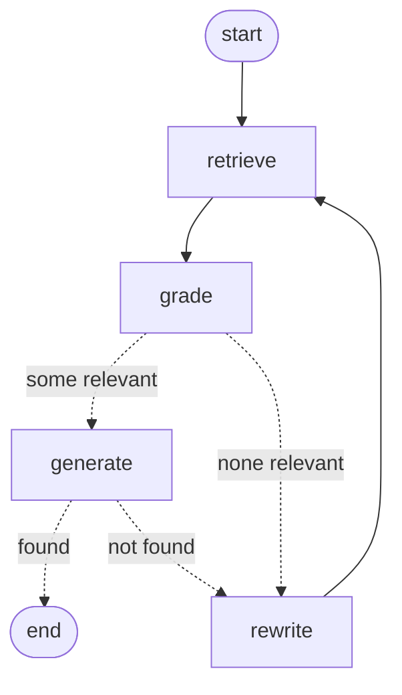

# Ask BlogChain

Ask a question, get an answer from the [BlogChain newsletter](https://paragraph.com/@kazani) archive, with citations to the exact posts.

Built in stages to learn retrieval-augmented generation (RAG) from first principles, then with production tooling.

## Stage 1a: keyword baseline (standard library only)

```
python3 ingest.py      # RSS feed -> data/posts.json      (20 posts, 16k words)
python3 chunk.py       # posts -> data/chunks.json        (76 chunks of ~300 words, 50 overlap)
python3 search.py "how did the trading bot do"            # BM25 top 5
python3 evaluate.py -v # score retrieval on data/eval.json
```

The eval set has 24 answerable questions with a known source post. Ten reuse the post's own words (`keyword`). Fourteen ask the same thing in different words (`paraphrase`). Two have no answer in the archive (`unanswerable`, used in later stages).

**BM25 results (chunk size 300):**

| style | n | hit@1 | hit@3 | hit@5 | MRR |
|---|---|---|---|---|---|
| keyword | 10 | 100% | 100% | 100% | 1.00 |
| paraphrase | 14 | 64% | 86% | 93% | 0.75 |
| all | 24 | 79% | 92% | 96% | 0.86 |

Keyword search is perfect when you use the author's words and drops sharply when you don't. That gap is what embeddings (Stage 1b) should close.

**Chunk size sweep (hit@5 / MRR, all questions):** 150 words: 88% / 0.83 · **300: 96% / 0.86** · 500: 92% / 0.86 · 1000: 96% / 0.80. Small chunks lose context. Large chunks mix topics, so the right post ranks lower.

## Stage 1b: embeddings, hybrid search, cited answers

```
python3 -m venv .venv && .venv/bin/pip install -r requirements.txt
echo "MESH_API_KEY=..." > .env          # Mesh API, OpenAI-compatible gateway
.venv/bin/python embed.py               # 76 chunks -> 1536-dim vectors (text-embedding-3-small)
.venv/bin/python evaluate.py hybrid     # bm25 | vector | hybrid
.venv/bin/python ask.py "Where did my trading bot finish?"
```

Vector search is plain numpy cosine similarity, the same exact search as FAISS `IndexFlatIP`. At 76 chunks a vector database adds nothing. Hybrid merges BM25 and vector rankings with reciprocal rank fusion.

| retriever | hit@1 keyword | hit@1 paraphrase | hit@1 all | hit@5 all | MRR |
|---|---|---|---|---|---|
| BM25 | 100% | 64% | 79% | 96% | 0.86 |
| vector | 90% | 79% | 83% | 92% | 0.86 |
| **hybrid** | **100%** | **79%** | **88%** | 92% | **0.89** |

Vectors fix paraphrase at the top rank (64% to 79%) but lose some exact-word matches, like "USDC on Chelsea's shirts". Hybrid keeps both strengths and has the best first-rank accuracy. With 24 questions, one question is about 4 points, so treat small gaps as noise.

`ask.py` sends the top 5 hybrid chunks to `gpt-4o-mini` with a rule to cite sources and to say "I couldn't find that in BlogChain" otherwise. Both unanswerable eval questions get that refusal. A typical answer costs about 1,700 input tokens, roughly $0.0003.

## Stage 2: structured outputs with Pydantic

```
.venv/bin/python -m unittest -v test_answers    # 11 offline tests, no key needed
.venv/bin/python ask.py "Where did my trading bot finish?"
.venv/bin/python evaluate_answers.py -v         # answer-level eval, ~$0.01
```

The model now returns JSON matching `schemas.Answer`: a `found` flag and a list of claims, each with its own source numbers. Two layers check it:

1. **Structured outputs** (`response_format` with `strict: true`) guarantee the shape.
2. **Pydantic validators** enforce rules a schema can't: source numbers must exist, every claim needs a source, `found` must agree with the claims. A failure sends the error text back to the model, up to 3 attempts.

Chunk citations are merged per post when printed, so three chunks of one post show as one source.

Hybrid search also now keeps only the best chunk per post, so one long post can't fill all 5 slots. That raised hybrid retrieval to hit@1 88%, hit@3 96%, hit@5 96%, MRR 0.91 (from 88% / 88% / 92% / 0.89 in the Stage 1b table). The answer results below use this version.

| answer metric | result |
|---|---|
| found / not-found correct | 25 / 26 |
| cites a correct post | 23 / 24 answerable |
| citation precision | 98% |
| retries needed | 0 |
| cost for 26 questions | ~$0.008 |

The one miss is a search miss, not an answer miss: the right post wasn't in the top 5, so the model said "not found" instead of guessing. Strict mode meant the shape never failed live, so the retry loop is proven by the offline tests, which force bad replies through a fake model.

## Stage 3: agentic RAG with LangGraph

```
.venv/bin/python -m unittest -v test_agent      # 4 offline routing tests
.venv/bin/python agent.py "Does giving an AI real-world results matter more than picking a smarter model?"
.venv/bin/python evaluate_answers.py agent -v   # ~$0.012
```

`agent.py` turns the straight pipeline into a graph that checks its own work (the corrective RAG pattern). Generated from the compiled graph with `get_graph().draw_mermaid()`:



- **grade**: one structured call marks which retrieved chunks actually answer the question. Only those reach the answer step.
- **rewrite**: if nothing relevant was found, or the answer step says "not found", the model writes a new query in different words. At most 2 rewrites.
- **generate**: the Stage 2 answer step, unchanged. With no relevant chunks it returns "not found" without an LLM call.

All three structured calls share one validate-and-retry helper (`ask.structured`).

| | Stage 2 pipeline | Stage 3 agent |
|---|---|---|
| found / not-found correct | 25 / 26 | **26 / 26** |
| cites a correct post | 23 / 24 | **24 / 24** |
| citation precision | 98% | **100%** |
| questions that looped | 0 retries | 4 rewrites (2 unanswerable, by design) |
| tokens for 26 questions | 55,697 | 81,200 (+46%) |

The rescued question took both loops: the grader wrongly kept one off-topic chunk, the answer step said "not found", and that sent it to rewrite, where the new query found the right post. Unanswerable questions now try 3 queries before giving up, which is where most of the extra tokens go.

**Known limits:** the RSS feed returns only the latest 20 posts. The eval questions were written after reading the posts, which flatters keyword search a little.
